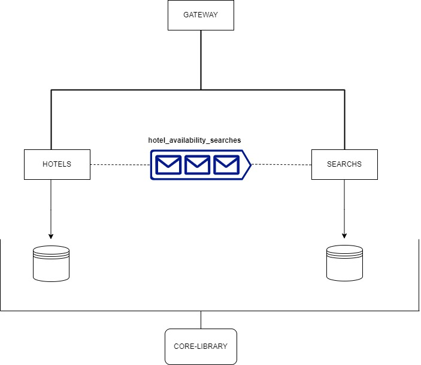

# Documentación de Projecto 

## Introducción

Este documento técnico describe los detalles del desarrollo. Proporciona una visión integral de la composición del proyecto, sus diferentes componentes y posibles mejoras.

## Tabla de Contenidos

- [Sección 1: Arquitectura](#seccion-1-arquitectura)
- [Sección 2: Microservicio Hotels](#seccion-2-microservicio-hotels)
- [Sección 3: Microservicio Search](#seccion-3-microservicio-search)
- [Sección 4: Infraestructura](#seccion-4-infraestructura)
- [Consideraciones](#consideraciones)

## Sección 1: Arquitectura

El desarrollo consta de dos microservicios, cada uno con su propia base de datos. Refleja una solución escalable e incorpora patrones necesarios para evitar problemas comunes.

Además, se incluye una biblioteca compartida para albergar clases compartidas por los microservicios, junto con la posibilidad de agregar utilidades y clases según sea necesario.

Finalmente, un API gateway sirve como el último actor, eliminando la necesidad de navegar constantemente a diferentes puertos.

### Elección Arquitectura

No está demás destacar que es completamente factible implementar las funcionalidades requeridas en un único repositorio, conectándonos a una sola base de datos y enviándonos eventos dentro del mismo "scope".

Se tomaron decisiones de implementación específicas para algunas funcionalidades. Por ejemplo, en lugar de simplemente desarrollar un @Repository, opté por hacerlo a través de una interfaz que inyecta la dependencia, proporcionándonos flexibilidad en caso de necesitar inyectar distintas bases de datos. 

## Sección 2: Microservicio Hotels

Este microservicio está diseñado para cumplir con las expectativas de validación del payload y una minima validacion de HotelId en PostgreSQL. Otro propósito es generar un evento y posteriormente enviarlo a Kafka.

### Mejoras Potenciales

- Implementar Flyway o Liquibase para el versionado de la base de datos.
- Seguridad básica a través de JWT.
- Endpoints de verificación de estado.
- Swagger Editor
- Uso de herramientas de logs y trackId.

## Sección 3: Microservicio Search

Principalmente, este microservicio maneja las funciones de guardar y buscar en nuestra base de datos MongoDB. Simultáneamente, consume eventos de la cola.

### Mejoras Potenciales

- Implementar una cola de mensajes en caso de situaciones límite (Dead Letter Queue).
- Seguridad básica a través de JWT.
- Endpoints de verificación de estado.
- Swagger Editor
- Uso de herramientas de logs y trackId.

## Sección 4: Infraestructura

Para trabajar en el proyecto, se ocuparán varios puertos, cada uno ejecutando diferentes herramientas localmente:

| Tecnología  | Puerto         | Herramienta   |
|:-----------:|:--------------:|:-------------:|
| MongoDB     | localhost:27017 | Docker        |
| Kafka       | localhost:9092  | Docker        |
| Kafdrop     | localhost:9000  | Docker        |
| Zookeeper   | localhost:2181  | Docker        |
| PostgreSQL  | localhost:5432  | Docker        |
| Gateway     | localhost:8080  | Spring Cloud  |
| Hotels      | localhost:8081  | Spring Boot   |
| Search      | localhost:8082  | Spring Boot   |

### Consideraciones

Ultimas consideraciones respecto al proyecto finalizado:

- Coverage en microservicios supera el 80%.
- Enviroment:
    - Se utilizo Spring Boot 3.2.2
    - JUnit 5 
    - Java 17
- Se trabajo con clases inmutables, en su mayoria record.
